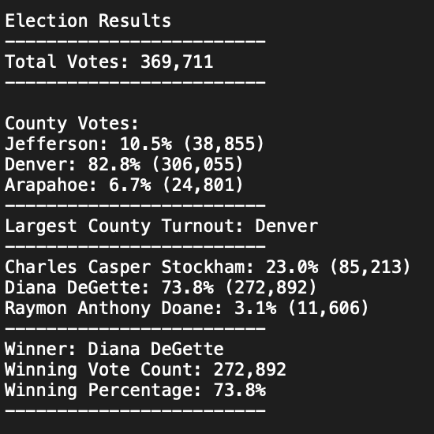
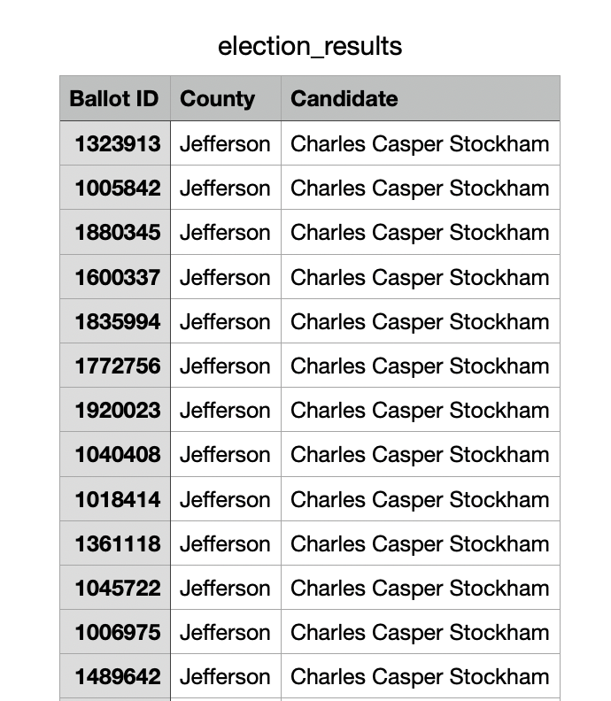

# Election_Analysis

## Project Overview
A Colorado Board of Elections employee has given you the following task to complete the election audit of a recent local congressional election.
- Calculate the total number of votes cast.
- Determine the voter turnout for each county.
- Determine the percentage of votes from each county out of the total count.
- Identify the county with the highest turnout.
- Get a complete list of candidates who received votes.
- Calculate the total number of votes each candidate received.
- Calculate the percentage of votes each candidate won.
- Determine the winner of the election based on popular vote.

## Resources
- Data Source: election_results.csv
- Software: Python 3.9.7, Visual Studio Code, 1.63.2

## Election-Audit Results
- The analysis of the election show that:
  - There were "369,711" votes cast in the election.

### Example of code to get total vote count
```Python
# Initialize a total vote counter.
total_votes = 0
       
    # For each row in the CSV file.
    for row in reader:

        # Add to the total vote count
        total_votes = total_votes + 1

# Save the results to our text file.
with open(file_to_save, "w") as txt_file:

    # Print the final vote count (to terminal)
    election_results = (
        f"\nElection Results\n"
        f"-------------------------\n"
        f"Total Votes: {total_votes:,}\n"
        f"-------------------------\n\n"
        f"County Votes:\n")
    print(election_results, end="")
```
- County Votes:
  - Jefferson: 10.5% (38,855)
  - Denver: 82.8% (306,055)
  - Arapahoe: 6.7% (24,801)
- Largest County Turnout: Denver

### Example of code to determine voter turnout, percentage of votes from each county and identify the county with the highest turnout
```Python
# 1: Create a county list and county votes dictionary.
county_list = []
county_votes= {}

# 2: Track the largest county and county voter turnout.
largest_county = ""
largest_county_turnout = 0
largest_county_percentage = 0

# Read the csv and convert it into a list of dictionaries
with open(file_to_load) as election_data:
    reader = csv.reader(election_data)

    # Read the header
    header = next(reader)

    # For each row in the CSV file.
    for row in reader:
        # 3: Extract the county name from each row.
        county_name = row[1]
       # 4a: Write an if statement that checks that the
        # county does not match any existing county in the county list.
        if county_name not in county_list:

            # 4b: Add the existing county to the list of counties.
            county_list.append(county_name)

            # 4c: Begin tracking the county's vote count.
            county_votes[county_name] = 0

        # 5: Add a vote to that county's vote count.
        county_votes[county_name] += 1
        print(county_name)
    # 6a: Write a for loop to get the county from the county dictionary.
    for county_name in county_votes:
        # 6b: Retrieve the county vote count.
        cvotes = county_votes.get(county_name)
        # 6c: Calculate the percentage of votes for the county.
        cvotes_percentage = float(cvotes) / float(total_votes) * 100
        county_results = (
            f"{county_name}: {cvotes_percentage:.1f}% ({cvotes:,})\n")
         # 6d: Print the county results to the terminal.
        print(county_results)
         # 6e: Save the county votes to a text file.
        txt_file.write(county_results)
         # 6f: Write an if statement to determine the winning county and get its vote count.
        if (cvotes > largest_county_turnout) and (cvotes_percentage > largest_county_percentage):
            largest_county_turnout = cvotes
            largest_county = county_name
            largest_county_percentage = cvotes_percentage

    # 7: Print the county with the largest turnout to the terminal.
    largest_county_summary = (
        f"-------------------------\n"
        f"Largest County Turnout: {largest_county}\n"
        f"-------------------------\n")
    print(largest_county_summary)

    # 8: Save the county with the largest turnout to a text file.
    txt_file.write(largest_county_summary)
```
- Candidate list
  - Charles Casper Stockham: 23.0% (85,213)
  - Diana DeGette: 73.8% (272,892)
  - Raymon Anthony Doane: 3.1% (11,606)
- The winner of the election was:
    - Dianna DeGette, who received 73.8% of the vote and 272,892 number of votes.

## Election-Audit Summary
- This script can be used with some modifications for any election to get the total vote count, determine the voter turnout for each region, determine the percentage of votes from each region, identify the region with the highest turnout, get a complete list of candidates, calculate the total number of votes for each candidate, calculated the percentage of votes each candidate won, and determine the winner of the election based on popular vote.
- The following .txt file will be written and the above criteria summarized when the script is ran

- The current script relies that the .csv file shows the following order: ballot ID, County/Region, and candidate.

- If the CSV file is not in the following order
  - The CSV columns can be rearranged (most cumbersome)
  - The candidate_name row index [2] can be modified dependening on which column the Candidate's name is
  - The county_name row index [1] will also need to be modified if the county or region is not in the second column
  - The variable name wherever county is listed can be substituted for state, city, if it is not identified as county.
```Python
        # Get the candidate name from each row.
        candidate_name = row[2]

        # 3: Extract the county name from each row.
        county_name = row[1]
```
